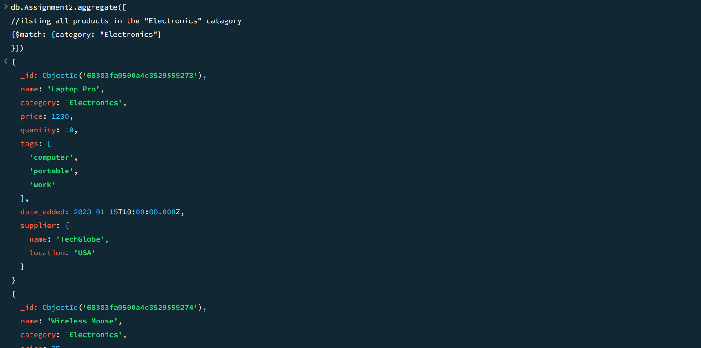
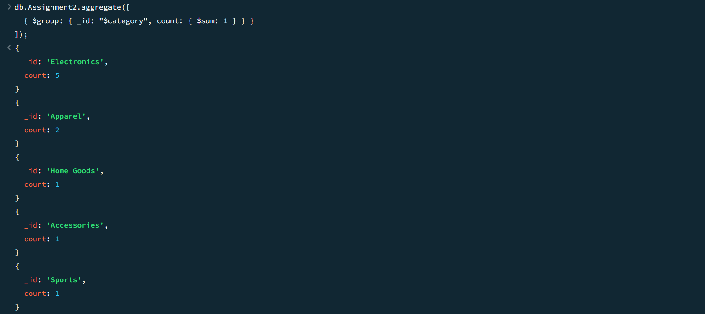
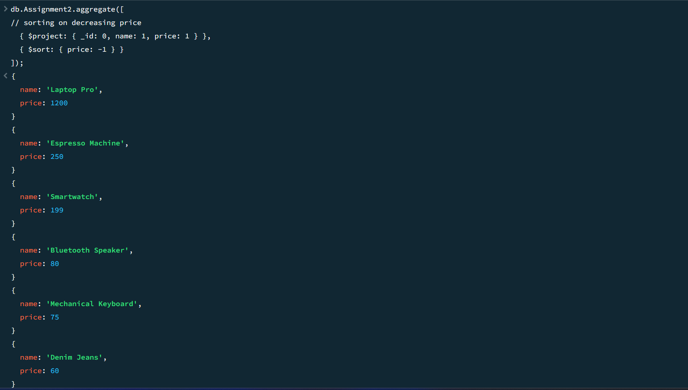

# MongoAssignment2 - Easy
Simple mongodb assignment

### 1 All products in the "Electronics" category
```
db.Assignment2.aggregate([
  { $match: { category: "Electronics" } }
]);

```

### 2 Count products per category
```
db.Assignment2.aggregate([
  { $group: { _id: "$category", count: { $sum: 1 } } }
]);

```

### 3 Product names and prices, sorted by price descending
```
db.Assignment2.aggregate([
  { $project: { _id: 0, name: 1, price: 1 } },
  { $sort: { price: -1 } }
]);

```
