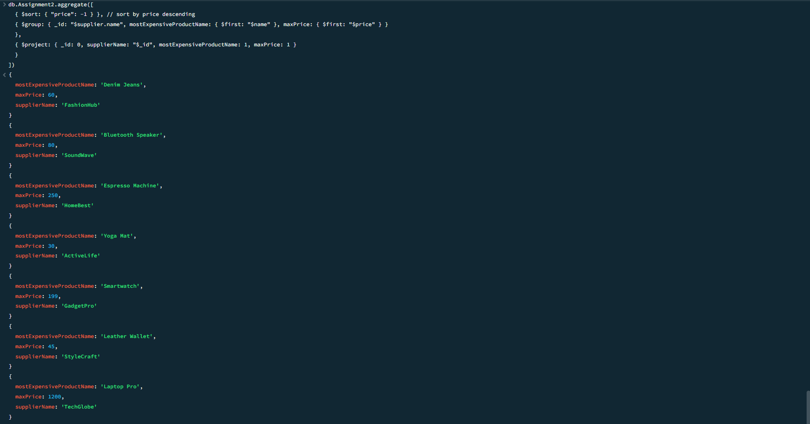

# MongoAssignment2 - Hard
Simple mongodb assignment

### 1 Most Expensive Product by Supplier
```
db.Assignment2.aggregate([
    { $sort: { "price": -1 } }, // sort by price descending
    { $group: { _id: "$supplier.name", mostExpensiveProductName: { $first: "$name" }, maxPrice: { $first: "$price" } }
    },
    { $project: { _id: 0, supplierName: "$_id", mostExpensiveProductName: 1, maxPrice: 1 }
    }
])
```

